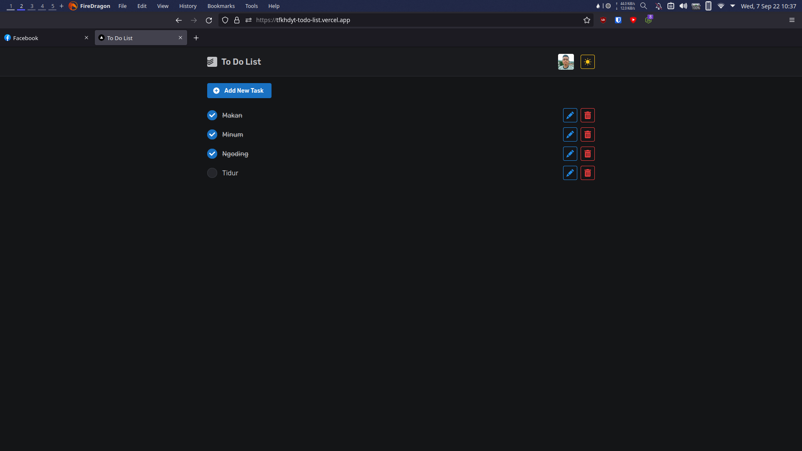

# To Do List



<p align='center'>Simple To Do List App with Authentication.</p>

## Tech Stack

- [Next.js](https://nextjs.org/)
- [TypeScript](https://www.npmjs.com/package/typescript)
- [Mantine](https://mantine.dev/)
- [NextAuth](https://next-auth.js.org/)
- [Prisma](https://www.prisma.io/)
- [PostgreSQL](https://www.postgresql.org/)
- [React Query](https://tanstack.com/query)
- [React Icons](https://www.npmjs.com/package/react-icons)
- [Next PWA](https://www.npmjs.com/package/next-pwa)

## Getting Started

### Prerequisites

- [Node.js](https://nodejs.org/en/)
- [PostgreSQL](https://www.postgresql.org/)
- [Google OAuth](https://support.google.com/cloud/answer/6158849?hl=en)
- [GitHub OAuth](https://docs.github.com/en/developers/apps/building-oauth-apps/creating-an-oauth-app)
- Any Node.js package manager (npm, yarn, **pnpm**)

### Installation

```bash
git clone https://github.com/tfkhdyt/todo-prisma
cd todo-prisma
pnpm install
# npm install
# yarn install

# setup environment variable
mv .env.example .env
# and then put your env to .env file

# start your postgresql
sudo systemctl start postgresql.service # linux with systemd, idk about Windows

# database migration
pnpm prisma migrate dev
```

#### Environment Variables

- `DATABASE_URL` = 'Your PostgreSQL database URL'
- `GOOGLE_ID` = 'Your Google OAuth Client ID'
- `GOOGLE_SECRET` = 'Your Google OAuth Client Secret'
- `GITHUB_ID` = 'Your GitHub OAuth Client ID'
- `GITHUB_SECRET` = 'Your GitHub OAuth Client Secret'
- `NEXTAUTH_URL` = 'Your app URL'
- `SECRET` = 'Random string'

Check [`.env.example`](https://github.com/tfkhdyt/todo-prisma/blob/main/.env.example) file for more info.

### Usage

```bash
# development
pnpm dev

# production
pnpm build
pnpm start

# if you change the database schema
pnpm prisma migrate dev # development
pnpm prisma migrate deploy # production
```

Open [http://localhost:3000](http://localhost:3000) with your browser to see the result.
